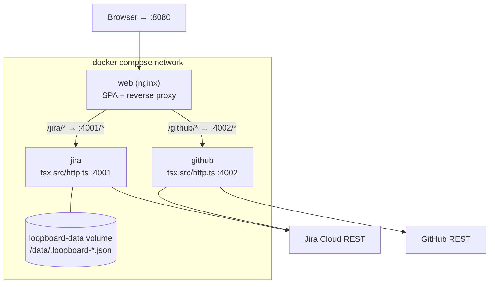

# Loopboard — Architecture

**Version:** 1.0  
**Date:** 2026-06-11  
**Author:** Architect Agent  
**Status:** Authoritative — aligns with `docs/CONTRACTS.md` (FINAL) and `docs/poc-spec.txt` v1.0

---

## 1. C4 Level 1 — System Context

```
┌─────────────────────────────────────────────────────────────────────────────────────┐
│                              EXTERNAL ACTORS                                        │
│                                                                                     │
│   ┌──────────────┐   ┌────────────────────┐   ┌──────────────┐                    │
│   │ Product Owner│   │  Scrum Master (SM) │   │  Developer   │                    │
│   │ (PO)         │   │                    │   │              │                    │
│   └──────┬───────┘   └─────────┬──────────┘   └──────┬───────┘                    │
│          │                     │                      │                             │
│          │  VS Code + Copilot  │                      │  VS Code + Copilot         │
│          │  (MCP stdio)        │  Browser (HTTP)      │  OR Browser                │
│          ▼                     ▼                      ▼                             │
└─────────────────────────────────────────────────────────────────────────────────────┘
          │                     │                      │
          ▼                     ▼                      ▼
┌─────────────────────────────────────────────────────────────────────────────────────┐
│                         LOOPBOARD [System]                                 │
│                                                                                     │
│   Exposes:                                                                          │
│   • MCP tools via stdio (consumed by GitHub Copilot / Claude)                      │
│   • HTTP bridge (consumed by React dashboard)                                       │
│   • React dashboard (accessed by browser)                                           │
└──────────────────────────┬──────────────────────────────────────────────────────────┘
                           │
          ┌────────────────┼────────────────┐
          ▼                ▼                ▼
  ┌──────────────┐  ┌────────────┐  ┌────────────┐
  │  Jira Cloud  │  │  GitHub    │  │  (Future:  │
  │  REST v3 +   │  │  REST API  │  │  MS Teams, │
  │  Agile API   │  │            │  │  Calendar) │
  └──────────────┘  └────────────┘  └────────────┘
```

### Context narrative

Three user roles interact with the system:

- **Product Owner** — primarily uses GitHub Copilot in VS Code (stdio MCP, full tool access) to create PO stories and dev tasks from plain-English descriptions. May also use the React dashboard to review the sprint board.
- **Scrum Master** — uses the React dashboard in a browser to view the daily huddle digest and sprint status. May use Copilot to trigger daily-huddle prompts.
- **Developer** — uses Copilot in VS Code to enhance ticket descriptions, list PRs, and link pull requests to Jira tickets.

The system talks to two external services:

- **Jira Cloud** — source of truth for tickets and sprints (Jira REST API v3 for issue CRUD, Agile API 1.0 for sprint/board reads).
- **GitHub REST API** — source of truth for pull requests; receives remote link comments; contributes PR metadata for auto-linking.

---

## 2. C4 Level 2 — Containers

```
┌────────────────────────────────────────────────────────────────────────────────────┐
│                              LOOPBOARD (monorepo)                         │
│                                                                                    │
│  ┌─────────────────────────────────────────────────────────┐                      │
│  │  packages/mcp-jira  (Node.js + TypeScript)              │                      │
│  │                                                         │                      │
│  │  ┌───────────────────┐   ┌──────────────────────────┐  │                      │
│  │  │ src/index.ts      │   │ src/http.ts              │  │                      │
│  │  │ stdio MCP entry   │   │ HTTP bridge :4001        │  │                      │
│  │  │ (for Copilot)     │   │ (for react-app)          │  │                      │
│  │  └────────┬──────────┘   └─────────┬────────────────┘  │                      │
│  │           │                        │                    │                      │
│  │           └──────────┬─────────────┘                    │                      │
│  │                      ▼                                  │                      │
│  │          ┌───────────────────────┐                      │                      │
│  │          │ src/tools/index.ts    │  ← transport-agnostic│                      │
│  │          │   ToolDef registry    │    tool registry     │                      │
│  │          └──────────┬────────────┘                      │                      │
│  │                     │ (calls)                           │                      │
│  │          ┌──────────▼────────────┐                      │                      │
│  │          │ src/lib/jiraClient.ts │  ← anti-corruption   │                      │
│  │          │   axios + HTTP Basic  │    layer             │                      │
│  │          └──────────┬────────────┘                      │                      │
│  │                     │ src/lib/adf.ts, prompts.ts,       │                      │
│  │                     │ config.ts, types.ts               │                      │
│  └─────────────────────┼───────────────────────────────────┘                      │
│                        │ HTTPS                                                     │
│                        ▼                                                           │
│                  Jira Cloud REST v3 + Agile 1.0                                   │
│                                                                                    │
│  ┌─────────────────────────────────────────────────────────┐                      │
│  │  packages/mcp-github  (Node.js + TypeScript)            │                      │
│  │                                                         │                      │
│  │  ┌───────────────────┐   ┌──────────────────────────┐  │                      │
│  │  │ src/index.ts      │   │ src/http.ts              │  │                      │
│  │  │ stdio MCP entry   │   │ HTTP bridge :4002        │  │                      │
│  │  └────────┬──────────┘   └─────────┬────────────────┘  │                      │
│  │           └──────────┬─────────────┘                    │                      │
│  │                      ▼                                  │                      │
│  │          ┌───────────────────────┐                      │                      │
│  │          │ src/tools/index.ts    │  ← same pattern      │                      │
│  │          │   ToolDef registry    │                      │                      │
│  │          └──────────┬────────────┘                      │                      │
│  │          ┌──────────▼────────────┐                      │                      │
│  │          │ src/lib/githubClient  │  ← anti-corruption   │                      │
│  │          │   Bearer token auth   │    layer             │                      │
│  │          └──────────┬────────────┘                      │                      │
│  │                     │ (also calls Jira for remote links) │                     │
│  └─────────────────────┼───────────────────────────────────┘                      │
│                        │ HTTPS                                                     │
│                        ▼                                                           │
│                  GitHub REST API + Jira REST v3                                   │
│                                                                                    │
│  ┌─────────────────────────────────────────────────────────┐                      │
│  │  packages/react-app  (Vite + React + TypeScript)        │                      │
│  │  Dev server :5173                                       │                      │
│  │                                                         │                      │
│  │  ┌──────────────────────────────────────────────┐      │                      │
│  │  │ Pages: Dashboard | TicketGen | Reports (stub)│      │                      │
│  │  │ Components: SprintBoard, HuddleDigest,       │      │                      │
│  │  │             ChatPanel                        │      │                      │
│  │  └──────────────────┬───────────────────────────┘      │                      │
│  │                     │                                   │                      │
│  │  ┌──────────────────▼───────────────────────────┐      │                      │
│  │  │ src/lib/mcpClient.ts                         │      │                      │
│  │  │ src/lib/chatRouter.ts (deterministic)        │      │                      │
│  │  │ src/lib/ticketTemplates.ts (deterministic)   │      │                      │
│  │  └──────────────────┬───────────────────────────┘      │                      │
│  └─────────────────────┼───────────────────────────────────┘                      │
│                        │ HTTP (CORS-restricted)                                    │
│          ┌─────────────┴──────────────┐                                            │
│          ▼                            ▼                                            │
│   mcp-jira HTTP bridge         mcp-github HTTP bridge                             │
│   :4001                        :4002                                              │
│                                                                                    │
└────────────────────────────────────────────────────────────────────────────────────┘

  Transport:
    VS Code Copilot ──── stdio (MCP protocol frames) ──── mcp-jira/mcp-github index.ts
    Browser           ── HTTP/JSON ──────────────────── react-app :5173
    react-app          ─ HTTP/JSON (fetch) ─────────── :4001 / :4002 bridges
```

### Container responsibilities

| Container | Runtime | Port | Consumers | External calls |
|---|---|---|---|---|
| `mcp-jira` stdio entry | Node.js | — | VS Code Copilot (Claude) | Jira Cloud |
| `mcp-jira` HTTP bridge | Node.js | 4001 | react-app | Jira Cloud |
| `mcp-github` stdio entry | Node.js | — | VS Code Copilot (Claude) | GitHub + Jira |
| `mcp-github` HTTP bridge | Node.js | 4002 | react-app | GitHub + Jira |
| `react-app` Vite dev server | Node.js (dev) | 5173 | Browser | mcp-jira :4001, mcp-github :4002 |

---

## 3. Architectural patterns in play

### 3.1 Ports-and-adapters (Hexagonal Architecture)

**What:** The tool registry (`src/tools/index.ts`) in each MCP package is the hexagonal core. Tool handlers contain all business logic and speak only in domain types (`TicketRef`, `IssueSummary`, etc.). Two adapters drive them:

- `src/index.ts` — the **stdio adapter**: wraps each handler in the MCP SDK's `server.registerTool()` frame, serializing results as `{ type: "text", text: JSON.stringify(...) }`.
- `src/http.ts` — the **HTTP adapter**: wraps the same handlers in Express routes, serializing results into the `{ ok: true, data: ... }` envelope.

**Why:** GitHub Copilot consumes MCP via stdio; the React dashboard cannot open a stdio channel (it runs in a browser context, served by Vite). Sharing handlers means zero duplicated business logic. A future WebSocket or SSE transport would add a third adapter without touching tool handlers or the Jira client.

**Coupling risk:** The `ToolDef` interface is the contract between adapters and handlers. Any change to `handler` signature or the `schema` type propagates to both adapters. This is acceptable; the interface is simple and internal.

### 3.2 Anti-corruption layer (ACL)

**What:** `src/lib/jiraClient.ts` (and `githubClient.ts`) is the ACL isolating the external API shape from the tool output shape.

**Why:** Jira's API returns deeply nested JSON (fields under `issues[n].fields`, ADF blobs for description, custom field names for story points). If tool handlers called `axios` directly they would couple to Jira's schema. The ACL translates the external representation into the domain types defined in `src/lib/types.ts`. When Jira changes a field name or response shape, only the ACL changes — tool handlers are unaffected.

**Consequence:** `adf.ts` (textToAdf / adfToText) belongs to the ACL concern even though it is a helper module. It must never leak ADF structures into tool outputs.

### 3.3 Contract-first parallel development

**What:** `docs/CONTRACTS.md` is established as the authoritative specification before any package is implemented. Three builder agents (Backend, Fullstack, Frontend) implement their packages in parallel using the contract as the sole source of truth.

**Why:** Without a written contract, parallel builders make incompatible assumptions about field names, error codes, and default values, requiring expensive rework when integration testing begins. The contract surfaces ambiguities before code is written.

**Governance:** Builders must not alter the interface surface (tool names, field names, port numbers, error codes). Discrepancies found during implementation are escalated to the Architect agent, not resolved unilaterally.

### 3.4 Deterministic server pattern (no in-process LLM calls)

**What:** MCP servers contain zero calls to any AI/LLM API. All digest generation (`summaryText` in `get_daily_huddle`) uses deterministic string templates. Claude is the *caller* of the MCP tools, not a dependency of them.

**Why:** MCP servers must be unit-testable without API keys and without network access (spec quality gate). LLM outputs are non-deterministic, making snapshot testing unreliable. The prompts registered via `server.registerPrompt()` are instructions *to* Claude, not invocations of Claude.

### 3.5 Monorepo with npm workspaces

**What:** All three packages live in one git repository under `packages/`, connected by `npm workspaces` in the root `package.json`.

**Why:** The React app and the MCP servers share type definitions and must agree on interface shapes without a published npm registry. Workspaces allow `import` across packages during development. The decision not to create a shared `@loopboard/shared` types package for the POC is documented in ADR-005.

---

## 4. Data flow walkthroughs

### 4.1 Ticket-pair creation via Copilot (spec §4.3)

```
User (PO/SM in VS Code)
  │
  │ "Create a PO story and dev task for password reset via email"
  ▼
GitHub Copilot + Claude (AI reasoning)
  │
  │ [Claude reads registered MCP prompts, decides to call draft_tickets]
  │ [Claude generates structured PO story + Dev task with Given/When/Then ACs]
  │
  ├─▶ MCP stdio call: create_po_ticket
  │     Input: { summary, description, storyPoints }
  │       ▼
  │     mcp-jira/src/tools/createPoTicket.ts
  │       ▼ textToAdf(description)
  │     jiraClient.ts: POST /rest/api/3/issue
  │       { issuetype: "Story", project: JIRA_PO_PROJECT_KEY, ... }
  │       ▼
  │     Jira Cloud → { key: "PO-42", self: "..." }
  │       ▼
  │     Return: TicketRef { key: "PO-42", url, board: "PO" }
  │
  └─▶ MCP stdio call: create_dev_ticket
        Input: { summary, description, linkedPoTicketKey: "PO-42" }
          ▼
        mcp-jira/src/tools/createDevTicket.ts
          ▼ textToAdf(description)
        jiraClient.ts: POST /rest/api/3/issue
          { issuetype: "Task", project: JIRA_DEV_PROJECT_KEY, ... }
          ▼
        Jira Cloud → { key: "DEV-99" }
          ▼
        jiraClient.ts: POST /rest/api/3/issueLink
          { type: { name: JIRA_LINK_TYPE }, inwardIssue: "DEV-99",
            outwardIssue: "PO-42" }
          [Link failure is swallowed; linkWarning added to output]
          ▼
        Return: TicketRef & { board: "DEV", linkedTo: "PO-42" }

Claude surfaces: "Created PO-42 (PO board) and DEV-99 (Dev board), linked."
```

Key points:
- Claude constructs the ticket content using the registered `draft_tickets` prompt template.
- The MCP server performs only structural transforms (textToAdf) and REST calls; it does not generate or embellish content.
- Link failure is non-fatal; the ticket is created regardless (see ADR-003).

### 4.2 Dashboard sprint load via HTTP bridge

```
Browser (react-app :5173)
  │
  │ useActiveSprint() hook mounts
  │ [page load or manual refresh]
  ▼
src/lib/mcpClient.ts
  │ callTool("jira", "get_active_sprint", { boardId: undefined })
  │
  ▼ HTTP POST http://localhost:4001/api/tools/get_active_sprint
    Body: {}
    ▼
mcp-jira/src/http.ts (Express :4001)
  │ Parse tool name → look up ToolDef registry
  │ Zod-validate input (boardId defaults applied inside handler)
  │
  ▼ handler: getSprint.ts
    │ getConfig() → JIRA_DEV_BOARD_ID (e.g. 10002)
    │
    ├─▶ jiraClient: GET /rest/agile/1.0/board/10002/sprint?state=active
    │     → { values: [{ id: 55, name: "Sprint 7", ... }] }
    │
    └─▶ jiraClient: GET /rest/agile/1.0/sprint/55/issue?maxResults=50
          → { issues: [ ... ] }
          ▼
        Map each issue to IssueSummary
          (blocked detection via labels / JIRA_FLAGGED_FIELD / status name)
        Compute totals
        ▼
HTTP response: { ok: true, data: { sprint: {...}, issuesByStatus: {...}, totals: {...} } }

react-app mcpClient.ts unwraps envelope → SprintBoard renders columns
```

CORS headers on the Express response allow `http://localhost:5173`.

### 4.3 PR-to-ticket auto-linking (Phase 2, spec §7)

```
Developer (VS Code Copilot or Dashboard ChatPanel)
  │
  │ "Link PR #47 to DEV-99"
  │ (or sync_pr_links runs automatically after create_dev_ticket)
  ▼
mcp-github tools: link_pr_to_ticket
  Input: { repo: "org/repo", number: 47, ticketKey: "DEV-99" }
  │
  ▼ githubClient: GET /repos/org/repo/pulls/47
    → { html_url: "https://github.com/org/repo/pull/47",
        title: "feat: password reset",
        body: "Closes DEV-99 ...", ... }
  │
  ├─▶ Jira remote link (idempotent):
  │     POST /rest/api/3/issue/DEV-99/remotelink
  │     { globalId: prUrl,
  │       object: { url: prUrl, title: "GitHub PR #47: feat: password reset" } }
  │     Jira upserts on globalId → safe to re-run
  │
  └─▶ GitHub PR comment (idempotent):
        GET /repos/org/repo/issues/47/comments
        [search for existing comment containing browse URL]
        If not found:
          POST /repos/org/repo/issues/47/comments
          { body: "🔗 Linked to Jira: https://<base>/browse/DEV-99" }
  │
  ▼ Return: { prUrl, results: [{ ticketKey: "DEV-99",
               remoteLinkCreated: true, commentPosted: true }] }

Auto-link flow (sync_pr_links):
  list_prs → each open PR → jiraKeys.ts regex scan (title + branch + body)
  → link_pr_to_ticket for each PR with detected keys
```

Key points:
- `jiraKeys.ts` regex `/\b([A-Z][A-Z0-9]{1,9}-\d+)\b/g` is a pure function with no network calls.
- Both Jira remote link and GitHub comment steps are idempotent.
- Per-key failures are captured into the result array, not thrown.

---

## 5. Non-functional notes

### 5.1 POC targets (current)

| Concern | POC stance |
|---|---|
| Deployment | Local dev (Node + Vite), **or** a single-host Docker stack — see §7–§8 and `docs/DEPLOYMENT.md` |
| Users | Single user (Jira service account = developer's own account) |
| Persistence | None — all state lives in Jira / GitHub; no local DB |
| Secrets management | `.env` file, never committed (`.gitignore` covers all `.env` files) |
| Authentication | HTTP Basic (Jira) + Bearer token (GitHub) — static credentials |
| Rate limiting | Not handled; Jira and GitHub rate limits rarely triggered at single-user scale |
| Error recovery | No retry logic; transient failures surface as `UPSTREAM` (502) |
| Observability | Startup logs to stderr; no structured logging or metrics |
| Security | Secrets never forwarded to browser (react-app calls bridges only; bridges hold env vars) |
| Test isolation | axios mocked with vitest `vi.mock`; no integration tests in POC |

### 5.2 Graduation path (hosted / multi-user)

When this POC graduates to a team-hosted service, the following changes are expected:

| Concern | Change required |
|---|---|
| Deployment | HTTP bridges deployed as hosted services (e.g. Render, Railway, Vercel Functions) |
| Authentication | Jira OAuth 2.0 (3LO) instead of HTTP Basic; GitHub OAuth app instead of PAT |
| Secrets | Hosted secret manager (Doppler, Vercel env vars, AWS Secrets Manager) |
| CORS | Set `CORS_ORIGINS` (comma-separated allowlist; `*` = any) — now env-configurable on both bridges. Not needed in the Docker reverse-proxy topology (same-origin). See §7. |
| Rate limiting | Exponential backoff + jitter in `jiraClient` / `githubClient`; per-user request queuing |
| Multi-user | `getConfig()` becomes request-scoped, reading per-user credentials from session |
| Persistence | Optional: a lightweight store for audit log of AI-created tickets |
| Observability | Structured JSON logging, request tracing, Sentry or similar |
| Shared types | Extract `@loopboard/shared` package (see ADR-005) |
| MCP transport | `StreamableHTTP` transport for hosted Copilot Extension or other remote MCP clients |

---

## 6. Key risks and mitigations

| Risk | Likelihood (POC) | Mitigation |
|---|---|---|
| Jira `customfield_10016` wrong for target instance | Medium | `JIRA_STORY_POINTS_FIELD` env var; spec §9 troubleshooting note |
| `JIRA_LINK_TYPE` "Relates" not configured in target instance | Low-Medium | See ADR-003; link failure is non-fatal (`linkWarning` in output) |
| stdio MCP stdout pollution breaks Copilot framing | High (if violated) | Hard rule: all logs to stderr; ADR-001 normative |
| ADF round-trip corruption | Low | `adf.ts` is unit-tested; ADF is produced and consumed only by the ACL |
| react-app `callTool` hitting wrong server URL | Low | `VITE_MCP_*_URL` env defaults; `BRIDGE_DOWN` error guides users |

---

## 7. MCP server connections & setup (quick reference)

Each MCP package (`mcp-jira`, `mcp-github`) is reachable two ways, both driven by
the **same** `src/tools/index.ts` registry (§3.1). This section consolidates how
each connection is configured.

### 7.1 stdio transport — VS Code Copilot (Claude)

This is the classic MCP server: Copilot launches the process and exchanges
JSON-RPC frames over the process's **stdin/stdout** (no port).

Registered in **`.vscode/mcp.json`** (auto-loaded when the repo root is open):

```jsonc
{
  "servers": {
    "jira":       { "type": "stdio", "command": "npx",
                    "args": ["tsx", "${workspaceFolder}/packages/mcp-jira/src/index.ts"] },
    "github-prs": { "type": "stdio", "command": "npx",
                    "args": ["tsx", "${workspaceFolder}/packages/mcp-github/src/index.ts"] }
  }
}
```

- **Lifecycle:** VS Code spawns/stops the processes; you never run `npm run
  dev:jira` yourself.
- **Framing rule (normative, ADR-001):** stdout carries MCP frames only — all
  logs go to **stderr**. Polluting stdout breaks Copilot. The smoke test asserts
  stdout stays clean.
- **Credentials:** same `.env` as the bridges (`src/lib/config.ts` + dotenv).
- **Scope:** a **local developer** integration. The stdio servers are **not**
  containerized or deployed (§8).

### 7.2 HTTP bridge transport — the React dashboard

Browsers can't open a stdio channel, so `src/http.ts` re-exposes the identical
registry over REST.

| | mcp-jira | mcp-github |
|---|---|---|
| Default port | `4001` (`MCP_JIRA_HTTP_PORT`) | `4002` (`MCP_GITHUB_HTTP_PORT`) |
| Routes | `GET /api/health` (+`boards`), `GET /api/tools`, `POST /api/tools/:name`, `POST /api/ai/*` | `GET /api/health`, `GET /api/tools`, `POST /api/tools/:name` |
| SPA base-URL env (build-time) | `VITE_MCP_JIRA_URL` | `VITE_MCP_GITHUB_URL` |

- **SPA wiring:** `src/lib/mcpClient.ts`, `aiClient.ts`, and `boards.ts` read the
  `VITE_MCP_*_URL` values **at build time** and call `${base}/api/...`. Default
  base is `http://localhost:4001` / `:4002` (local dev).
- **CORS:** allowlist from `CORS_ORIGINS` (comma-separated; `*` = any), read at
  request time; default `http://localhost:5173,http://127.0.0.1:5173`. Requests
  with no `Origin` (server-to-server / same-origin) are always allowed.
- **Envelope:** every response is `{ ok: true, data }` or `{ ok: false, error:
  { code, message, issues? } }`.

---

## 8. Deployment topology (Docker)

The containerized stack ships **only** the HTTP bridges + the SPA (the stdio
servers stay on developer machines). The browser talks to a **single origin**;
`nginx` serves the SPA and reverse-proxies the bridges, so there is **no CORS**
and the bridge ports need not be exposed to the browser.

```
  Browser ── http://localhost:8080 ──▶ ┌─────────────────────────────┐
                                       │  web  (nginx:alpine)         │
        /jira/api/...  ───────────────▶│  • serves SPA (dist/)        │
        /github/api/... ──────────────▶│  • proxy /jira  → jira:4001  │
                                       │  • proxy /github→ github:4002│
                                       └─────────────┬───────────────┘
                              ┌──────────────────────┴───────────────┐
                              ▼                                       ▼
                   ┌────────────────────┐                 ┌────────────────────┐
                   │ jira (node:20)     │                 │ github (node:20)   │
                   │ tsx src/http.ts    │                 │ tsx src/http.ts    │
                   │ :4001  + /data vol │                 │ :4002              │
                   └─────────┬──────────┘                 └─────────┬──────────┘
                             ▼                                       ▼
                       Jira Cloud REST                     GitHub REST (+ Jira)
```



| Container | Image base | Runs | Port | Notes |
|---|---|---|---|---|
| `web` | `nginx:alpine` (multi-stage build via `node:20-alpine`) | SPA + reverse proxy | `8080:80` | SPA built with `VITE_MCP_JIRA_URL=/jira`, `VITE_MCP_GITHUB_URL=/github` |
| `jira` | `node:20-alpine` | `tsx src/http.ts` | `4001` | mounts `loopboard-data:/data`; `JIRA_LEAVES_FILE`/`JIRA_TEAM_FILE` → `/data` |
| `github` | `node:20-alpine` | `tsx src/http.ts` | `4002` | — |

**Why `tsx` at runtime:** the MCP packages' `build` script is `tsc --noEmit`
(type-check only; no JS emitted), and they run via `tsx` (`npm run start:http`).
So the bridge images keep devDependencies. This is fine for a POC; a slimmer
image would add a JS emit step and run plain `node` — see `docs/DEPLOYMENT.md`.

Artifacts: `docker-compose.yml`, `docker/{jira,github,web}.Dockerfile`,
`docker/nginx.conf`, `.dockerignore`, `.env.docker.example`. Full run + production
guidance in **`docs/DEPLOYMENT.md`**.
